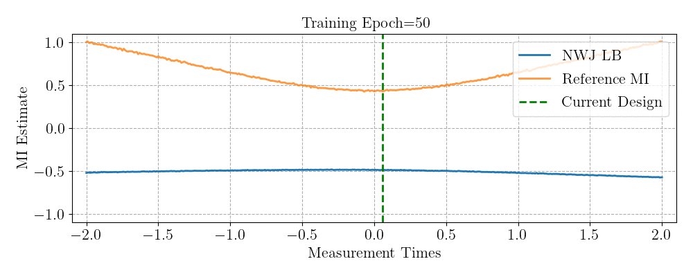

# GradBED

Research code for the submission "Gradient-Based Bayesian Experimental Design for Implicit Models using Mutual Information Lower Bounds". This repository is actively being updated to make the code more usable for others.




## CPU Setup

Install conda dependencies and the project with

```bash
conda env create -f environment.yml
conda activate gradbed-env
python setup.py develop
```

Separately install the torchsde package for simulating the SDE-based epidemiological models:

```
pip install git+https://github.com/google-research/torchsde.git
```

If the dependencies in `environment.yml` change, update dependencies with

```bash
conda env update --file environment.yml
```

## GPU Cluster Setup

Check local versions of cuda available: ls -d /opt/cu*. You should use one of these (e.g. the latest version) for the cudatoolkit=??.? argument below.

Create a Conda environment with GPU-enabled PyTorch (with e.g. Cuda 10.1): 

```bash
conda create -n gradbed-env python=3.8 pytorch torchvision cudatoolkit=10.1 -c pytorch
conda activate gradbed-env
```

Then install dependencies in the GPU environment file:

```bash
conda env update --file environment-gpu.yml
```

Separately install the torchsde package for simulating the SDE-based epidemiological models:

```
pip install git+https://github.com/google-research/torchsde.git
```

The above command with the environment file can also be used to update the Conda environment when dependencies in the environment file change.